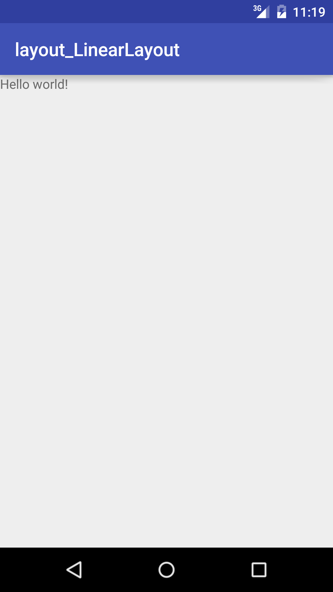

# サポート情報

## 最終更新日

* 2015/10/12

## 目次
* [Chapter 1](#Chapter-1)
* [Chapter 2](#Chapter-2)
* [Chapter 3](#Chapter-3)
* [Chapter 4](#Chapter-4)
* [Chapter 5](#Chapter-5)
* [Chapter 6](#Chapter-6)
* [Chapter 7](#Chapter-7)
* [Chapter 8](#Chapter-8)
* [Chapter 9](#Chapter-9)
* [Chapter 10](#Chapter-10)
* [Chapter 11](#Chapter-11)
* [Chapter 12](#Chapter-12)
* [Appendix 1](#Appendix-1)
* [Appendix 2](#Appendix-2)

## Chapter 1

### 2015/10/09
* サンプルプロジェクトをすべてAndroid Studio 1.4を元に作り直しました。

### 2015/10/07
■ サンプル layout_LinearLayout
* Android Studio 1.4を元にプロジェクトを作り直しました。

* P.4の実行結果のイメージをLinearLayoutであることがわかるように差し替えました。(サンプルソースは修正済み)     

## Chapter 2

### 2015/10/12
■ app_FragmentLifecycle
* サンプルプロジェクト中のMainFragment.javaで呼び出しているonAttach()はAndroid Support library v23.0.0より非推奨となりました。サンプルを実行すると取り消し線が表示されます。

## Chapter 3

## Chapter 4

## Chapter 5

## Chapter 6

## Chapter 7

## Chapter 8

## Chapter 9

## Chapter 10

## Chapter 11

## Chapter 12

## Appendix 1

## Appendix 2
